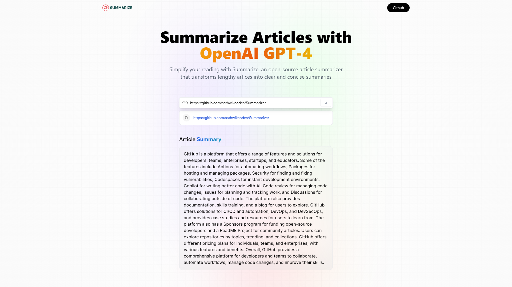

# Summarizer
## Live : https://summarizer-hazel.vercel.app/

  

This was done as a practise from youtube for api stuff. This is a comprehensive application that includes both front-end and back-end development components. It's designed to be flexible and scalable, allowing users to find summary of any any article online with ease.

## Technologies Used

This application uses a range of modern technologies, including:

- **Front-end:** React, Next.js, Radix

- **Back-end:**  MongoDB, Chatgpt API

## Features

The Summarizer includes a range of features that include:

- **Article Summarizer where user can get a 2-3 lines of the article they wish to summarize**
- **Local Storage** where the history of previous articles will be stored and displayed.
## Installation and Usage

To use this full stack web application, you'll need to follow a few simple steps:

1\. Clone this repository to your local machine.

2\. Install the required dependencies by running `npm install`.

3\. Start the application by running `npm run dev`.

Once the application is running, you can access it by opening your web browser and navigating to `http://localhost:5173/`.

## Contributing

If you're interested in contributing to this full stack web application, please feel free to submit a pull request or open an issue. Your contributions are always welcome!

## License

This full stack web application is licensed under the [MIT License](https://opensource.org/licenses/MIT). You're free to use it in your own projects or modify it as needed.
